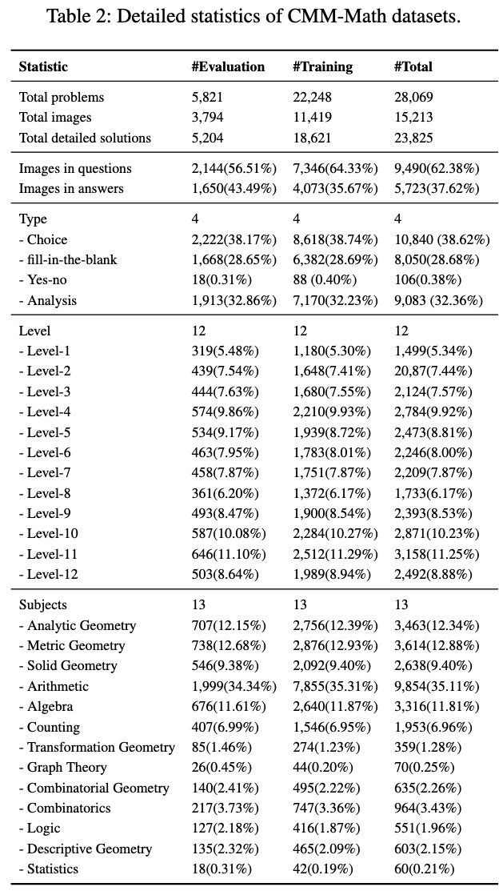
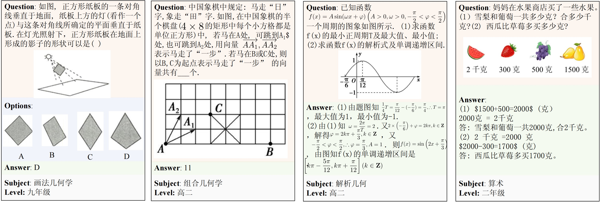
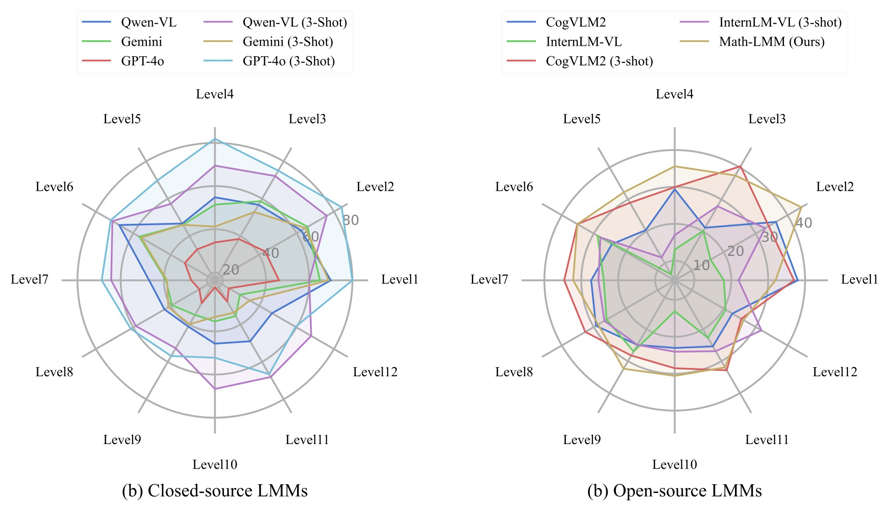
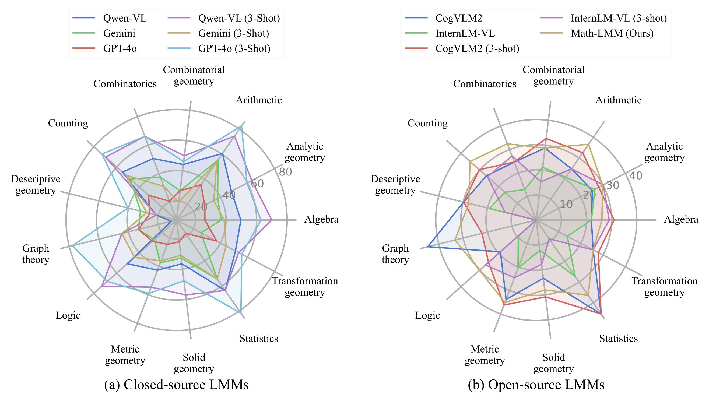
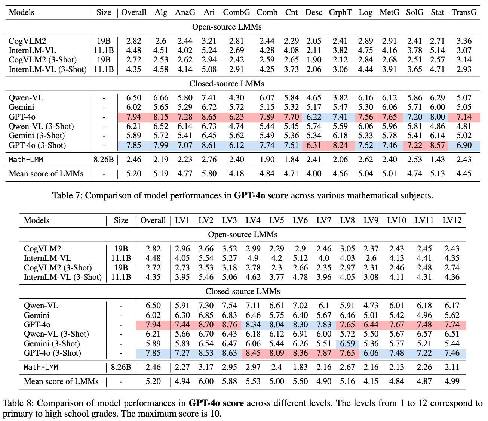

# EduChat-MATH

## Introduction
Large language models (LLMs) have obtained promising results in mathematical reasoning, which is a foundational skill for human intelligence. Most previous studies focus on improving and measuring the performance of LLMs based on textual math reasoning datasets (e.g., MATH, GSM8K). Recently, a few researchers have released English multimodal math datasets (e.g., MATHVISTA and MATH-V) to evaluate the effectiveness of large multimodal models (LMMs). In this paper, we release a Chinese multimodal math (CMM-Math) dataset, including benchmark and training parts, to evaluate and enhance the mathematical reasoning of LMMs. CMM-Math contains over 28,000 high-quality samples, featuring a variety of problem types (e.g., multiple-choice, fill-in-the-blank, and so on) with detailed solutions across 12 grade levels from elementary to high school in China. Specifically, the visual context may be present in the questions or opinions, which makes this dataset more challenging. Through comprehensive analysis, we discover that state-of-the-art LMMs on the CMM-Math dataset face challenges, emphasizing the necessity for further improvements in LMM development. We release the Chinese Multimodal Mathemathical Dataset (CMM-Math), which contains 22k+ training samples and 5k+ evaluation samples.

## Statistic of CMM-Math
<p align="center">

</p>


Paper link: https://arxiv.org/pdf/2409.02834
```
@article{liu2024cmm,
  title={CMM-Math: A Chinese Multimodal Math Dataset To Evaluate and Enhance the Mathematics Reasoning of Large Multimodal Models},
  author={Liu, Wentao and Pan, Qianjun and Zhang, Yi and Liu, Zhuo and Wu, Ji and Zhou, Jie and Zhou, Aimin and Chen, Qin and Jiang, Bo and He, Liang},
  journal={arXiv preprint arXiv:2409.02834},
  year={2024}
}
```

## Examples
<p align="center">

</p>

## Evaluation of LMMs

### Results of Various Levels
<p align="center">

</p>


### Results of Various Subject
<p align="center">

</p>

### Results of Accuracy
<p align="center">

</p>

### Results of GPT-4o Score
<p align="center">

</p>

